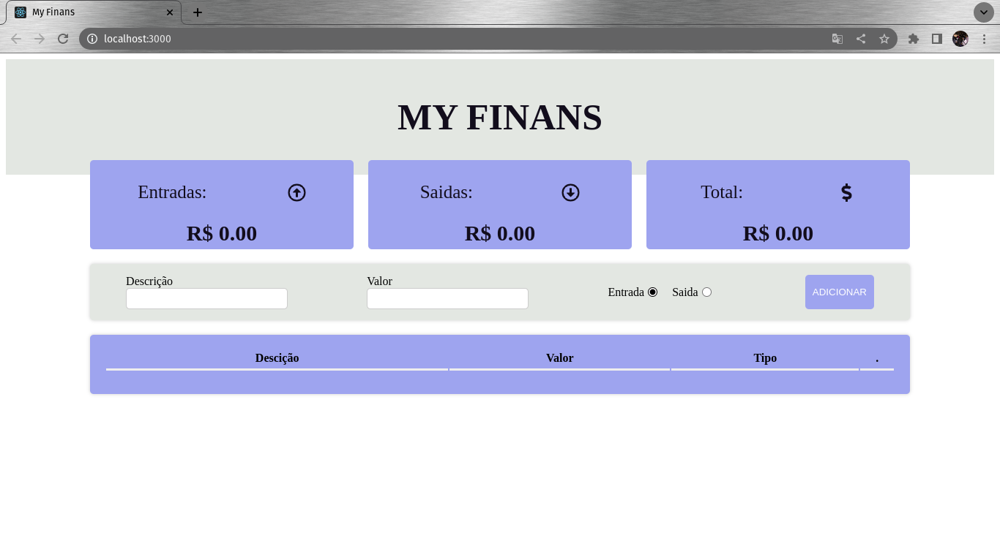

<h1>Projeto de Orçamento Pessoal</h1>

Este projeto foi desenvolvido utilizando React Native, com a finalidade de ajudar quem precisa controlar suas finanças.

Ele usa o LocalStorage para armazenar os dados para consulta

Sua estrtura é bem básica com um campo para coleta de informações em um FORM, e um CARD para apresentalas tanto com o informativo de ENTRADAS/SAIDAS e o TOTAL, quanto um detalhado das despesas

<h1>Veja o inicio do Projeto</h1>
